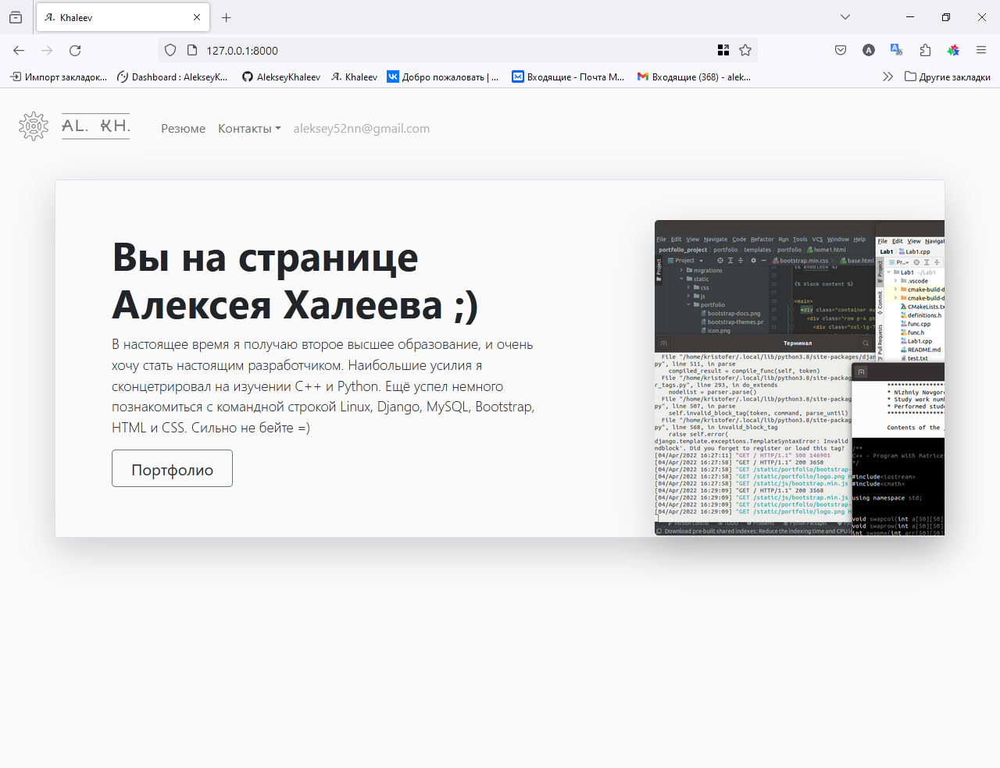
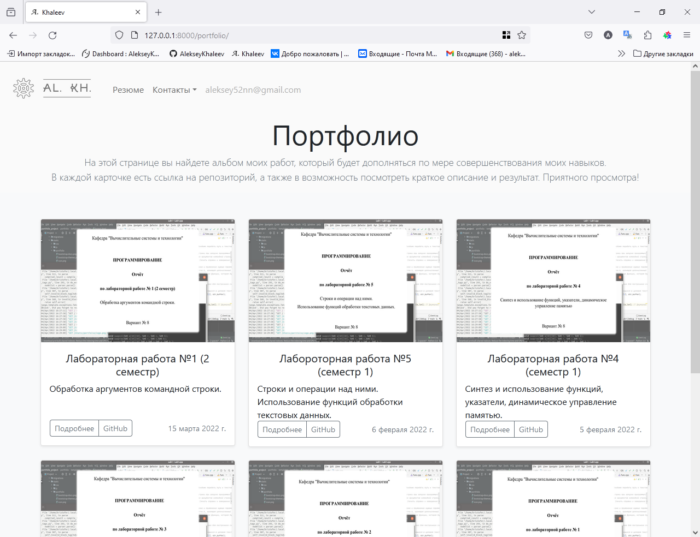
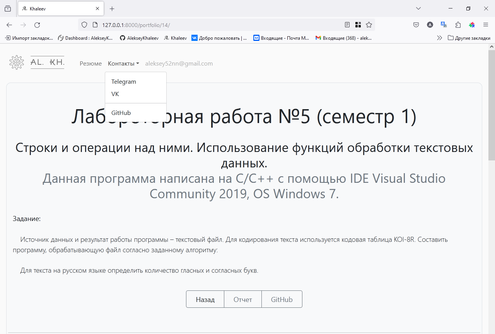
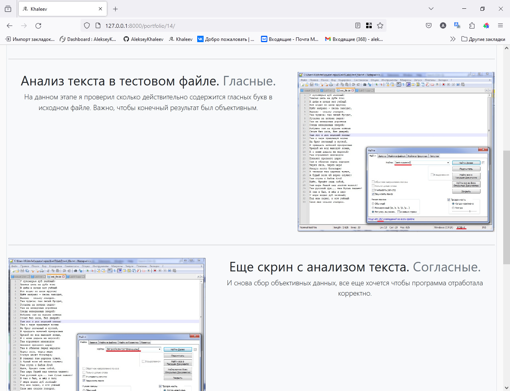

# Визитка на Django

Это мой первый проект, реализованный с использованием фреймворка Django. Данный сайт-визитка создан в рамках ознакомления с Django и включает в себя примеры работ и контактную информацию.

## О проекте

- **Фреймворк:** Django
- **Шаблоны и стили:** Использованы решения из библиотеки Bootstrap с некоторыми изменениями CSS стилей.
- **Функционал:** Навигационная панель, модальные окна, кликабельные картинки в подробном описании работ, возможность добавления видео.
- **Адаптивность:** Сайт адаптирован для работы как на мобильных устройствах, так и на десктопах.

## Мой опыт

- **Обучение:** Один ознакомительный курс по Django + много гугла и документации.
- **Цель проекта:** Практика и ознакомление с основами работы с Django.

## Установка и запуск

1. **Клонируйте репозиторий:**

    ```bash
    https://github.com/AlekseyKhaleev/portfolio-site.git
    cd portfolio-site
    ```

2. **Установите Poetry:**

    Следуйте [официальной инструкции по установке Poetry](https://python-poetry.org/docs/#installation).

3. **Создайте и активируйте виртуальное окружение с помощью Poetry:**

    ```bash
    poetry install
    poetry shell
    ```

4. **Примените миграции:**

    ```bash
    python manage.py migrate
    ```

5. **Запустите сервер разработки:**

    ```bash
    python manage.py runserver
    ```

6. **Перейдите по адресу:**

    ```
    http://127.0.0.1:8000
    ```

## Скриншоты


*Главная страница*


*Страница с примерами работ*


*Контакты*


*Наполнение страницы проекта*

## Используемые технологии

- **Django:** Веб-фреймворк на Python.
- **Bootstrap:** CSS-фреймворк для адаптивного дизайна.
- **HTML/CSS:** Основные технологии для разметки и стилизации.


## Лицензия

Этот проект распространяется под лицензией MIT. Подробности см. в файле [LICENSE](LICENSE).

---

Спасибо за интерес к моему проекту!
